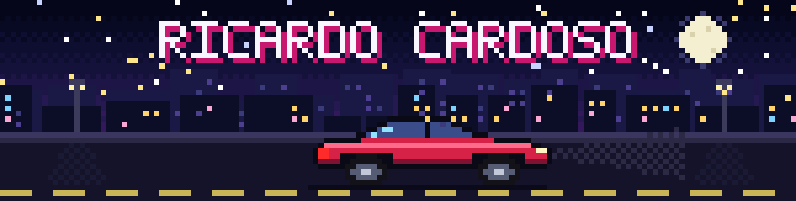

## 👋 Sobre mim

- 🎓 Estudante de **Ciência da Computação** na **UniMAX**, em Indaiatuba, SP
- 💻 Em formação como **Desenvolvedor Full Stack**
- 🎯 Buscando minha primeira oportunidade de **estágio em TI**
- 🌎 Inglês intermediário

## 🛠️ Tecnologias

**Uso hoje**

  
  
  
  

**Estudando agora**

  
  

**Ferramentas**

  

## 🚀 Projetos

| Projeto | Descrição |
| --- | --- |
| 💡 **LuxSmart** | Front-end de um poste inteligente de iluminação pública, com dashboards comparando os gastos de iluminação de Indaiatuba. Projeto acadêmico em grupo. |
| 🌐 **Site interativo** | Grade de serviços, carrossel de projetos estilo Coverflow e linha do tempo animada que acompanha a rolagem. |
| 🏐 **Vôlei de praia 2D** | Jogo em pixel art para desktop, com sets até 21 pontos, melhor de 3 e três níveis de dificuldade. Em desenvolvimento. |

<!--
## 📊 Estatísticas
Tire este bloco do comentário quando tiver repositórios públicos.

  
  

  

-->

## 📫 Contato

  
  

